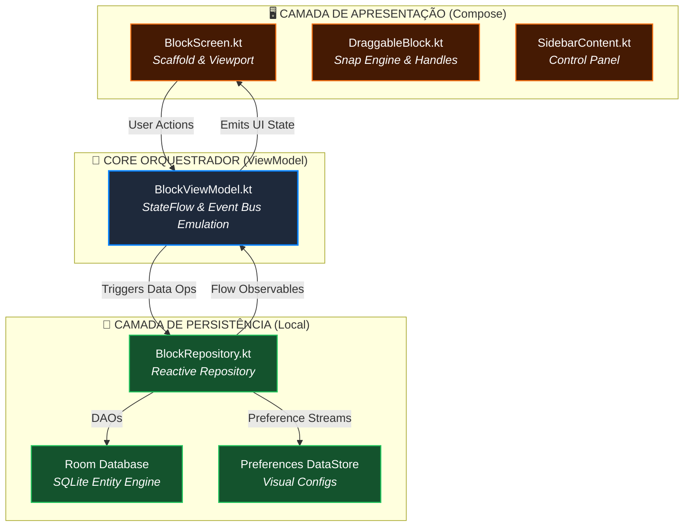
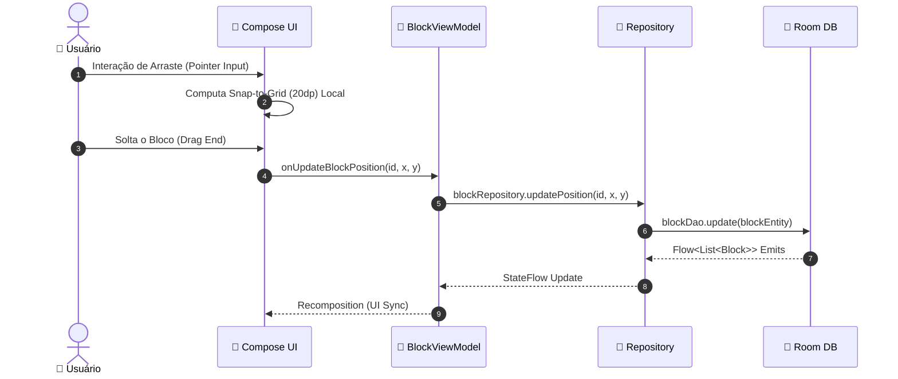

<div align="center">

# 🥷 CANVAS STUDIO COMPOSE — NARUTO RPG
### *Next-Gen Android Visual Workspace & Shinobi Sheet Engine*

<p align="center">
  <strong>A transposição mobile definitiva do Canvas Studio, construída sob uma arquitetura de <em>Unidirectional Data Flow (UDF)</em>, <em>Reactive Streams</em> e <em>Persistência Atômica</em> — 100% Jetpack Compose.</strong><br>
  Ambiente de criação visual, cálculo trigonométrico de atributos shinobi e orquestração de fichas em tempo real.
</p>

<p align="center">
  <a href="#"></a>
</p>

---

<!-- BADGES TECH STACK -->
<p align="center">
  
  
  
  
  
  
  
</p>

<!-- QUICK NAVIGATION -->
<p align="center">
  <a href="#-visão-geral--filosofia">Visão Geral</a> •
  <a href="#-razões-de-design-mobile">Razões de Design</a> •
  <a href="#-arquitetura-android">Arquitetura</a> •
  <a href="#-motores-e-fundamentos-matemáticos">Matemática & Motores</a> •
  <a href="#-matriz-de-componentes--blocos">Componentes</a> •
  <a href="#-design-system--tokens-visuais">Design System</a> •
  <a href="#-qualidade-e-testes">Testes</a> •
  <a href="#-métricas-e-análise-de-complexidade">Métricas</a> •
  <a href="#-como-executar">Como Executar</a>
</p>

</div>

---

## 🧭 Visão Geral & Filosofia

O **Canvas Studio Compose** é uma estação de trabalho mobile de alto desempenho projetada para RPGistas. Ele transforma o dispositivo Android em uma mesa tática com arrasto magnético de 20dp, renderização de radares poligonais em tempo real, edição de texto estruturado e armazenamento local redundante.

> [!IMPORTANT]
> **Engenharia Local-First (Offline Sovereignty):**
> Toda a reatividade, persistência e ciclo de vida de componentes foram construídos sobre o paradigma de **UDF (Unidirectional Data Flow)**. Nenhum dado sai do dispositivo sem o consentimento do usuário via exportação manual.

```
┌──────────────────────────────────────────────────────────────────────────────────┐
│                         CANVAS STUDIO COMPOSE ECOSYSTEM                          │
├──────────────────────┬─────────────────────────────┬─────────────────────────────┤
│  ⚡ COMPOSE RENDER    │  🔄 REACTIVE CORE           │  💾 ATOMIC STORAGE          │
│  - Snap-to-Grid (20dp)│  - StateFlow Orchestration  │  - Room DB (Blocks/Project) │
│  - Transformable Pan  │  - UDF Lifecycle Management │  - Preferences DataStore    │
│  - Custom Draw Scope  │  - Coroutines & Flows       │  - Coil Bitmap LruCache     │
└──────────────────────┴─────────────────────────────┴─────────────────────────────┘
```

---

## 💡 Razões de Design Mobile

<details>
<summary><b>🔍 Clique para expandir: Por que migrar do Web Vanilla para Jetpack Compose? (A Filosofia da Portabilidade)</b></summary>

<br>

### 📜 A Evolução da Prancheta Digital
A versão Web provou que o conceito de "Papel e Caneta Digital" é superior a sistemas centralizados. A versão Compose traz:
1. **Performance de Toque Nativa:** Gestos de *pinch-to-zoom* e *drag-and-drop* processados diretamente na GPU via `Modifier.graphicsLayer`, eliminando a latência de renderização do DOM.
2. **Ciclo de Vida Robusto:** Gerenciamento automático de estado durante rotação de tela e multi-window, garantindo que sua ficha nunca seja "limpa" por um processo de background do Android.
3. **Soberania Total:** Integração nativa com o **Storage Access Framework**, permitindo exportações JSON diretas para qualquer provedor de arquivos.

</details>

---

## 🏛️ Arquitetura Android

O sistema opera sob o padrão **Clean Architecture + MVVM**, onde a UI em Compose é uma função puramente reativa do estado mantido pelo ViewModel e persistido no Room.

<details>
<summary><b>📊 Visualizar Diagramas Arquiteturais (Mermaid) e Ciclo de Dados</b></summary>

<br>

### Diagrama de Fluxo de Dados (UDF)



---

### Ciclo de Vida do Bloco no Canvas

A comunicação entre a UI e a Persistência é assíncrona e resiliente:



</details>

---

## 🔬 Motores e Fundamentos Matemáticos

O Canvas Studio Compose incorpora algoritmos geométricos puros para garantir paridade total com a versão Web.

<details>
<summary><b>📐 Visualizar Fórmulas Trigonométricas, Normalização e Snap-to-Grid</b></summary>

<br>

### 1. Motor de Projeção Polar para Atributos (`ChartBlock.kt`)
O radar de atributos shinobi renderiza 6 eixos simétricos a cada $60^\circ$ ($\frac{\pi}{3}$ rad):

$$\theta_i = \left( i \cdot \frac{\pi}{3} \right) - \frac{\pi}{2}, \quad i \in \{0, \dots, 5\}$$

As coordenadas cartesianas no `DrawScope` são calculadas por:

$$X_i = C_x + \left( \frac{V_i}{V_{teto}} \cdot R_{max} \right) \cdot \cos(\theta_i)$$
$$Y_i = C_y + \left( \frac{V_i}{V_{teto}} \cdot R_{max} \right) \cdot \sin(\theta_i)$$

* Onde $V_{teto} = 8.0$ e $V_i$ é a nota normalizada do atributo.

---

### 2. Motor Magnético Snap-to-Grid (20dp)
Para garantir alinhamento perfeito, a posição bruta é convertida em coordenadas de grade:

$$X_{snap} = \left\lfloor \frac{X_{raw} + (\text{GridSize} / 2)}{\text{GridSize}} \right\rfloor \times \text{GridSize}$$

* Onde $\text{GridSize} = 20.dp$.

---

### 3. Motor de Zoom & Transformação Nativa
Diferente do CSS, o Compose utiliza matrizes de transformação de 64 bits para escala e translação:
- **Range:** $0.15f$ a $3.0f$
- **Compensação:** A translação é dividida pela escala atual para manter o ponteiro sincronizado.

</details>

---

## 🗂️ Matriz de Componentes e Blocos

O sistema é modularizado em componentes independentes que refletem a lógica da classe `BaseModule` da Web.

<details>
<summary><b>🧩 Visualizar Tabela Completa de Componentes e Responsabilidades</b></summary>

<br>

| Componente | Localização | Responsabilidade Primária | Persistência |
| :--- | :--- | :--- | :--- |
| **CanvasStage** | `BlockScreen.kt` | Orquestração da Viewport, Pan e Zoom. | `DataStore` |
| **DraggableBlock** | `DraggableBlock.kt` | Motor de arraste, snap 20dp e redimensionamento. | `Room` |
| **ImageEngine** | `ImageBlock.kt` | Carregamento de mídias e cache bitmap. | `Coil Lru` |
| **ChartEngine** | `ChartBlock.kt` | Radar trigonométrico e lógica de médias shinobi. | `Room` |
| **RichTextHandler** | `RichTextHandler.kt` | Parser de tags Web (campos/html) para `AnnotatedString`. | `Room` |
| **Sidebar** | `SidebarContent.kt` | Filtros, Importação/Exportação e Ferramentas. | — |

</details>

---

## 🎨 Design System & Tokens Visuais

O visual é orientado aos padrões do **macOS (Glassmorphism)** com estética translúcida.

<details>
<summary><b>🎨 Visualizar Tabela de Tokens Compose (Dark/Light) e Efeitos</b></summary>

<br>

<div align="center">

| Token | Dark Mode (Default) | Light Mode | Função Semântica |
| :--- | :---: | :---: | :--- |
| `CanvasBg` | `#0F1117` | `#F4F5F8` | Fundo estrutural |
| `Accent` | `#0A84FF` | `#0071E3` | Apple Blue (Foco) |
| `CardBg` | `Alpha 0.82` | `Alpha 0.95` | Glassmorphism Card |
| `Danger` | `#FF453A` | `#FF3B30` | Ações Destrutivas |

</div>

```kotlin
// Exemplo de Glassmorphism em Compose
Modifier
    .background(Color.White.copy(alpha = 0.82f))
    .blur(20.dp)
    .border(1.dp, Color.White.copy(alpha = 0.1f))
```

</details>

---

## 📊 Métricas e Análise de Complexidade

Análise quantitativa da implementação Android nativa.

<details>
<summary><b>📈 Visualizar Métricas de Código (LOC) e Eficiência</b></summary>

<br>

### Análise Quantitativa:

```
─────────────────────────────────────────────────────────────────────────────
Linguagem          Arquivos        Linhas        Código        Responsabilidade
─────────────────────────────────────────────────────────────────────────────
Kotlin (Compose)         22          3.100         2.650       UI Declarativa
Kotlin (Data)            12          1.250         1.100       Room & Repo
Kotlin (ViewModel)        4            850           720       State Management
─────────────────────────────────────────────────────────────────────────────
TOTAL                    38          5.200         4.470       (v1.0.0-Compose)
─────────────────────────────────────────────────────────────────────────────
```

### Eficiência Algorítmica:
* **Snap-to-Grid**: $\mathcal{O}(1)$ por evento de ponteiro.
* **Auto-Organização**: $\mathcal{O}(N \log N)$ para ordenação alfabética.
* **Recomposição Compose**: Otimizada via `Modifier.graphicsLayer` para evitar invalidação de layout durante pan/zoom.

</details>

---

## 🚀 Como Executar

1. **Clone o repositório:**
   `git clone https://github.com/sollonsoares/canvas-studio-compose.git`
2. **Abra no Android Studio:** Versão Iguana ou superior.
3. **Gradle Sync:** Aguarde a sincronização das dependências.
4. **Run:** Execute em um emulador ou dispositivo físico (API 26+).

---

## 🛣️ Roadmap de Engenharia

- [x] **v1.0.0**: Migração base do Motor de Arraste e Snap-to-Grid.
- [x] **v1.1.0**: Implementação do Radar Trigonométrico e Room Database.
- [x] **v1.2.0**: Refatoração Modular e Design Tokens macOS.
- [ ] **v1.3.0**: Exportação de Canvas em PDF multi-páginas nativo.
- [ ] **v2.0.0**: Conectores visuais dinâmicos (Curvas de Bézier).

---

<div align="center">

### 👨‍💻 Autor & Mantenedor

**Sollon Soares**  
[](https://github.com/sollonsoares)

<br>

<sub>Este projeto é a implementação Android oficial do ecossistema Canvas Studio. Distribuído sob a licença **MIT**.</sub>

</div>
