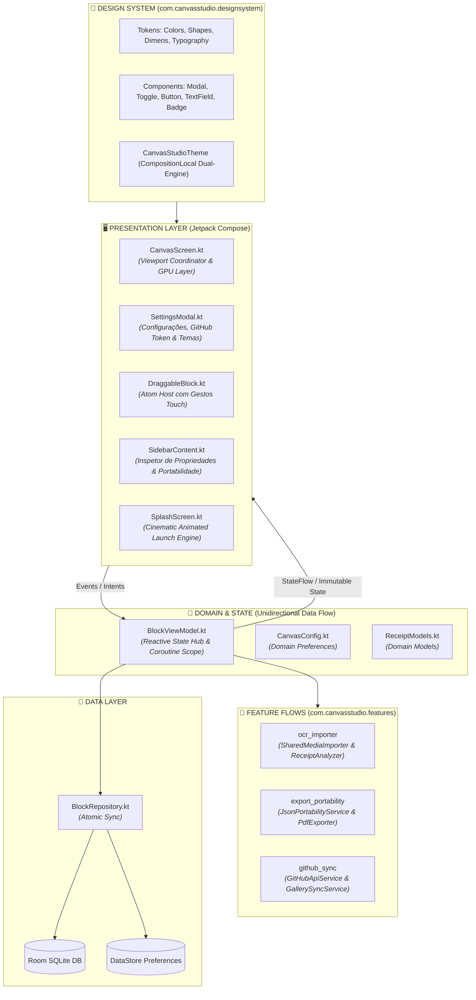
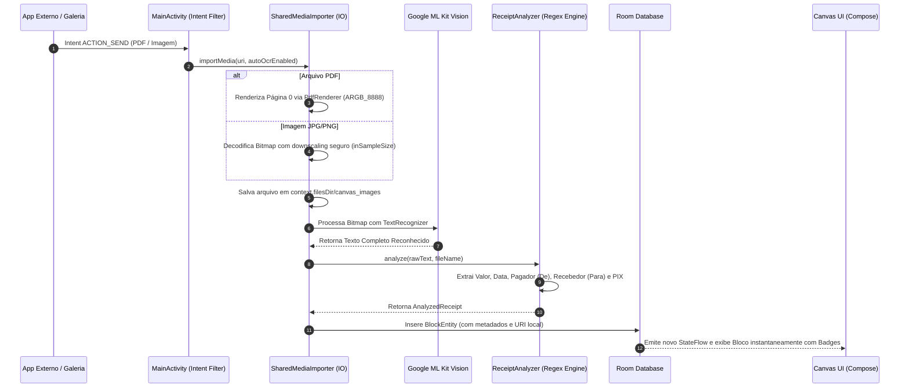
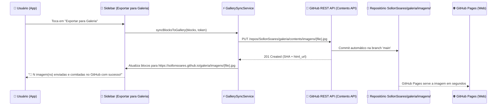

<div align="center">

# 🎨 CANVAS STUDIO COMPOSE
### *Next-Gen Reactive Infinite Canvas Engine & On-Device Intelligence*

<p align="center">
  <strong>O estado da arte em engenharia visual, arquitetura reativa e design industrial para Android. Uma plataforma de workspace espacial infinito com renderização acelerada por GPU, Design System de Duplo Universo (Apple vs Teenage Engineering), pipeline de IA On-Device (Google ML Kit OCR), automação de commits na nuvem (GitHub REST API) e portabilidade bidirecional de dados.</strong>
</p>

<p align="center">
  
  
  
  
  
  
</p>

---

### 📑 Sumário Executivo & Arquitetural
[1. Visão Geral](#-visão-geral-do-sistema) • 
[2. Design System & Duplo Universo](#-design-system-centralizado--duplo-universo-visual) • 
[3. Splash Screen Animada Cinematográfica](#-splash-screen-animada-cinematográfica) • 
[4. Arquitetura Modular por Flows](#-arquitetura-modular-por-flows) • 
[5. Motores de Engenharia & Performance GPU](#-motores-de-engenharia--performance-gpu) • 
[6. Pipeline de IA & OCR On-Device](#-pipeline-de-ia--ocr-on-device) • 
[7. Automação Cloud & Sync GitHub REST API](#-automação-cloud--sync-direto-github-rest-api) • 
[8. Portabilidade & Esquema JSON v2.0.0](#-portabilidade-e-esquema-de-dados-v200) • 
[9. Análise Quantitativa & Eficiência Algorítmica](#-análise-quantitativa-do-código--eficiência-algorítmica) • 
[10. Guia de Execução e Build](#-guia-de-execução-e-engenharia)

</div>

---

## 🌟 Visão Geral do Sistema

O **Canvas Studio Compose** é um ambiente de computação espacial bidimensional de alta precisão projetado para manipulação livre de blocos (texto rico com markdown, mídia de alta resolução, gráficos vetoriais multieixo e comprovantes financeiros). Construído 100% sobre **Jetpack Compose**, o sistema elimina completamente o overhead de Views legadas através de transformações diretas em GPU e um micro-kernel reativo impulsionado por Kotlin Coroutines e StateFlow.

### 💎 Principais Diferenciais Técnicos:
* **Renderização 60/120 FPS cravados**: Transformações espaciais (Pan e Zoom infinito de `0.15x` a `3.0x`) desacopladas da fase de layout via `graphicsLayer`.
* **Design System de Duplo Universo Estético**: Metamorfose completa em tempo real entre o minimalismo fluido da **Apple Cupertino (Sir Jony Ive)** e a engenharia física e tátil da **Teenage Engineering (Jesper Kouthoofd)**.
* **On-Device Vision AI (OCR)**: Análise em tempo real de comprovantes bancários (PIX, TED, Tributos, Boletos) via **Google ML Kit Vision**, com extração inteligente de valores, partes (`De`/`Para`), instituição e timestamp.
* **Automação de Commits Diretos no GitHub**: Sincronização e upload automático de imagens para o repositório [`SollonSoares/galeria`](https://github.com/SollonSoares/galeria) via GitHub Contents API, gerando URLs públicas no GitHub Pages em segundos.
* **Shield de Memória & SQLite Anti-Crash**: Eliminação do estouro de `CursorWindow` (2MB) através do salvamento atômico em disco de arquivos locais (`file:///`) com *downsampling* inteligente de fotos pesadas da câmera (`inSampleSize`).

---

## 🎨 Design System Centralizado & Duplo Universo Visual

Todo o ecossistema visual do aplicativo é orquestrado pelo pacote `com.canvasstudio.designsystem`, provido via `CompositionLocalProvider` e desacoplado de regras de negócio.

Ao alternar o tema nas **Configurações**, todo o aplicativo sofre uma **transformação estrutural de geometria, tipografia, bordas e grade**:

```
┌───────────────────────────┬────────────────────────────────────────────────────────┐
│ ATRIBUTO DE ENGENHARIA    │ 🍏 1. APPLE CUPERTINO          │ 🎛️ 2. TEENAGE ENGINEERING      │
├───────────────────────────┼────────────────────────────────┼───────────────────────┤
│ Autor Inspirador          │ Sir Jony Ive                   │ Jesper Kouthoofd      │
│ Filosofia                 │ Vidro, fluidez e pureza        │ Hardware mecânico e tátil       │
│ Tipografia                │ Sans-Serif Proporcional        │ Monospaçada / DIN Técnica      │
│ Geometria dos Blocos      │ Squircles suaves (14dp - 24dp) │ Cantos usinados retos (4dp)   │
│ Bordas dos Blocos         │ Hairline translúcida (1dp)     │ Chanfro sólido usinado (1.5dp) │
│ Grade do Canvas           │ Pontos circulares polidos      │ Cruzetas técnicas de estúdio (+)|
│ Badges Financeiros        │ Cápsulas ovais fluidas (999dp) │ Brackets de LED [ PIX ] [ R$ ] │
│ Identificador do Módulo   │ Discreto e minimalista         │ LED luminoso indicador tátil  │
│ Acento Primário           │ #0A84FF / #007AFF (Apple Blue) │ #FF4500 (OP-1 Signal Orange)  │
└───────────────────────────┴────────────────────────────────┴───────────────────────┘
```

### 🧱 Componentes Atômicos Padronizados:
* **`CanvasModal`**: Diálogo em 3 camadas (cabeçalho fixo com botão de fechar, corpo com rolagem independente e rodapé de ações ancorado que nunca sobrepõe o conteúdo).
* **`CanvasToggle`**: Switch customizado com thumb branco, trilha no tom de destaque (`colors.accent`) e escala uniforme de `0.85f`.
* **`CanvasButton`**: Botões tipados (`Primary`, `Secondary`, `Outlined`, `Ghost`, `Danger`) com ripple nativo e cantos estruturados.
* **`CanvasTextField`**: Entradas de texto com foco reativo e estados de erro.
* **`CanvasBadge`**: Pílulas de alta legibilidade para estados financeiros e tags com adaptação visual por tema.

---

## 🎬 Splash Screen Animada Cinematográfica

O componente [`SplashScreen.kt`](app/src/main/java/com/canvasstudio/ui/splash/SplashScreen.kt) oferece uma experiência visual de alta fidelidade ao inicializar o aplicativo:

1. **Halo de Luz Ambiente (*Pulse Glow*)**: Brilho radial que pulsa suavemente no centro com `Brush.radialGradient`, criando profundidade espacial na tela OLED.
2. **Grade Reativa em Background**: Revela a matriz de fundo em transição suave (pontos circulares na Apple ou cruzetas técnicas na Teenage Engineering).
3. **Monograma Central com Física de Mola**: O logo surge com dinâmica de mola orgânica (`Spring.DampingRatioMediumBouncy`) envolto por um anel com gradiente angular rotativo.
4. **Expansão Tipográfica (*Letter-Tracking Reveal*)**: O título `CANVAS STUDIO` surge com expansão de espaçamento entre letras de `0.5sp` para `3.5sp`.
5. **Transição de Saída Fluida (*Seamless Exit*)**: Ao carregar, a tela expande suavemente para `1.08x` com fade-out gradual, revelando o Canvas perfeitamente.

---

## 🏛️ Arquitetura Modular por Flows

O sistema adota os princípios de **Clean Architecture** e **Modular Feature-Driven Development**:



---

## 🔬 Motores de Engenharia & Performance GPU

```
┌────────────────────────────────────────────────────────────────────────┐
│                        GPU ACCELERATED PIPELINE                        │
│                                                                        │
│   Touch Gestures ──► detectTransformGestures ──► Offset/Scale Mutable   │
│                                                       │                │
│                                                       ▼                │
│                 Draw Phase (Zero Recomposition) ◄── graphicsLayer      │
└────────────────────────────────────────────────────────────────────────┘
```

### 1. Motor de Transformação Espacial ($\mathcal{O}(1)$)
A navegação pelo Canvas não dispara recomposições na árvore de composables. As matrizes de translação e escala são aplicadas na fase de renderização da GPU via `graphicsLayer`:
$$\begin{bmatrix} X_{render} \\ Y_{render} \\ 1 \end{bmatrix} = \begin{bmatrix} S & 0 & T_x \\ 0 & S & T_y \\ 0 & 0 & 1 \end{bmatrix} \begin{bmatrix} X_{world} \\ Y_{world} \\ 1 \end{bmatrix}$$

### 2. Motor de Grade Magnética Infinita (*State Deferral*)
O componente `CanvasBackground` consome o estado de escala e offset através de provedores de função lambda (`scale = { scale }`, `offset = { offset }`). Isso permite que a grade trace seus eixos ortogonais no `DrawScope` sem invalidar os nós estruturais da interface.

### 3. Motor Poligonal Multieixo (Radar Chart)
Renderizador trigonométrico para diagramação radial com eixos uniformes em intervalos de $60^\circ$ ($\frac{\pi}{3}\text{ rad}$):
$$X_i = C_x + \left( \frac{V_i}{V_{max}} \cdot R \right) \cos\left( i \cdot \frac{\pi}{3} - \frac{\pi}{2} \right)$$
$$Y_i = C_y + \left( \frac{V_i}{V_{max}} \cdot R \right) \sin\left( i \cdot \frac{\pi}{3} - \frac{\pi}{2} \right)$$

---

## 🤖 Pipeline de IA & OCR On-Device

O aplicativo integra um pipeline assíncrono para processar imagens e arquivos PDF compartilhados diretamente de apps bancários (Itaú, Nubank, Banco do Brasil, Bradesco, Santander, Inter, etc.):



### 🎯 Capacidades do Extrator:
* **Identificação de Transação PIX**: Detecta chaves, termos bancários e aplica badge ciano `[PIX]`.
* **Segregação Rigorosa de Partes**: Separação precisa entre Pagador/Origem (`De`) e Destinatário/Favorecido (`Para`), eliminando falsos positivos com preposições.
* **Formatador Monetário**: Conversão de strings de OCR para floats numéricos auditáveis (`R$ 1.250,50` $\rightarrow$ `1250.50f`).
* **Timestamp**: Captura e formatação de data/hora da realização do pagamento.

---

## 🌐 Automação Cloud & Sync Direto (GitHub REST API)

O módulo [`GitHubApiService.kt`](app/src/main/java/com/canvasstudio/features/export_portability/GitHubApiService.kt) permite o envio e commit direto de imagens do celular para o repositório da sua Galeria Web:



---

## 📄 Portabilidade e Esquema de Dados (v2.0.0)

O Canvas Studio adota portabilidade bidirecional compatível com a Web através do serviço isolado `JsonPortabilityService`.

### 📑 Esquema JSON Exportado (`JSON Export`):
Todos os valores financeiros, metadados e o **texto bruto completo do OCR (`rawText`)** são preservados diretamente dentro do array `campos` de cada bloco:

```json
{
  "metadata": {
    "versao": "2.0.0",
    "timestamp": 1787303429050,
    "brand": "Canvas Studio"
  },
  "blocos": {
    "data_t_1_45231": {
      "top": "60px",
      "left": "60px",
      "width": 320,
      "height": 480,
      "type": "image",
      "title": "Pix - João Silva",
      "url": "https://sollonsoares.github.io/galeria/imagens/comprovante_pix_1.jpg",
      "campos": [
        {
          "html": "<div><b>Valor:</b> R$ 150,00</div><div><b>Realizado em:</b> 21/08/2026 14:30</div><div><b>De (Pagador):</b> SOLLON SOARES</div><div><b>Para (Destinatário):</b> JOAO DA SILVA</div><div><b>Instituição:</b> NU PAGAMENTOS S.A.</div>",
          "className": "sub-campo",
          "valor": 150.00,
          "valorFormatted": "R$ 150,00",
          "realizadoEm": "21/08/2026 14:30",
          "isPix": true,
          "de": "SOLLON SOARES",
          "pagador": "SOLLON SOARES",
          "para": "JOAO DA SILVA",
          "destinatario": "JOAO DA SILVA",
          "instituicao": "NU PAGAMENTOS S.A.",
          "banco": "NU PAGAMENTOS S.A.",
          "rawText": "Comprovante de pagamento Pix\nNome: SOLLON SOARES\nRecebedor: JOAO DA SILVA\nValor: R$ 150,00..."
        }
      ]
    }
  }
}
```

---

## 📊 Análise Quantitativa do Código & Eficiência Algorítmica

### 📈 1. Distribuição Quantitativa do Código por Subsistema

O projeto é composto por **66 arquivos fonte**, somando **7.017 linhas de código puro (SLOC)** e **8.482 linhas totais**:

| Subsistema | Arquivos | Linhas Totais | SLOC (Código) | Comentários | Linhas Branco | % do Código |
| :--- | :---: | :---: | :---: | :---: | :---: | :---: |
| **UI & Canvas Engine (Compose)** | 18 | 4.240 | **3.862** | 83 | 295 | **55,0%** |
| **Design System & Tokens** | 9 | 859 | **786** | 13 | 60 | **11,2%** |
| **Suíte de Testes (Unit & AndroidTest)** | 9 | 1.059 | **825** | 80 | 154 | **11,8%** |
| **Exportação, Sincronização e Portabilidade** | 4 | 745 | **652** | 15 | 78 | **9,3%** |
| **Domínio, OCR & Inteligência Financeira** | 4 | 611 | **519** | 21 | 71 | **7,4%** |
| **Camada de Dados (Room, DAOs, Prefs)** | 13 | 448 | **374** | 1 | 73 | **5,3%** |
| **App Shell, Configurações & DI** | 9 | 560 | **524** | 8 | 28 | **7,5%** |
| **TOTAL** | **66** | **8.482** | **7.017** | **220** | **1.245** | **100%** |

---

### ⚙️ 2. Eficiência Algorítmica e Estruturas de Dados por Subsistema

#### A. Engine Gráfica de Renderização (`CanvasBackground`, `DraggableBlock`, `ChartBlock`)
* **Grade Infinita Zero-Allocation**: O componente `CanvasBackground` utiliza um buffer pré-alocado `FloatArray(16000)` memorizado via `remember`. Isso garante complexidade espacial de alocação $\mathcal{O}(1)$ na fase de desenho, eliminando coletas de lixo (*GC pauses*) a 60/120 FPS.
* **Complexidade da Grade**: $\mathcal{O}\left(\frac{W_{\text{tela}} \times H_{\text{tela}}}{\text{snapSize}^2}\right)$, proporcional à área da viewport visível e independente do tamanho absoluto do Canvas.
* **Transformações e Gestos**: O cálculo de coordenadas em `detectTransformGestures` e `detectDragGestures` opera em $\mathcal{O}(1)$ por evento de toque.
* **Radar Chart**: Projeção trigonométrica polar $\rightarrow$ cartesiana em $\mathcal{O}(1)$ para $N=6$ vértices com escala autoajustável.

#### B. Gerenciamento de Estado e Busca (`BlockViewModel`)
* **Busca com Cache de Hash**: `getSearchableText` calcula $\text{hash} = \text{hash}(\text{title}) + \text{hash}(\text{contentJson})$. Com cache hit, a filtragem opera em $\mathcal{O}(B \times M)$ ($B = \text{blocos}, M = \text{termos}$), evitando re-parsing de JSON desnecessário.
* **Auto-Organização Espacial 2D**: Algoritmo 2D Bin Packing guloso com ordenação alfabética em $\mathcal{O}(N \log N)$ de tempo e $\mathcal{O}(N)$ de memória.

#### C. OCR e Inteligência Heurística (`ReceiptAnalyzer`, `SharedMediaImporter`)
* **Proteção Proativa de Heap (Downsampling)**: Leitura de cabeçalho `inJustDecodeBounds` com escala exponencial $2^k$ (`inSampleSize`), limitando a alocação máxima a 2048px e reduzindo o consumo de RAM de $\approx 192\text{ MB}$ para $\le 16\text{ MB}$.
* **Parser de Comprovantes**: Máquina de estados contextual com threshold de proximidade ($K \le 4$ linhas) e checagem em `Set` $\mathcal{O}(1)$ contra termos bancários proibidos (`INVALID_NAME_WORDS`), executando em tempo linear $\mathcal{O}(L)$ ($< 5\text{ ms}$).

#### D. Portabilidade e I/O (`JsonPortabilityService`, `GallerySyncService`, `PdfExporter`)
* **Parser JSON Universal**: Travessia em profundidade (DFS) $\mathcal{O}(\text{Nós})$ com suporte a estruturas chave-valor (Web) e arrays (Mobile).
* **Streaming de Exportação**: O `PdfExporter` e o empacotador de ZIP utilizam streams contínuos (`PdfDocument`, `ZipOutputStream`), operando em $\mathcal{O}(1)$ de memória RAM adicional.

---

### 📊 3. Tabela Comparativa de Complexidade dos Algoritmos

| Algoritmo / Operação | Módulo / Arquivo | Complexidade Tempo (Pior Caso) | Complexidade Tempo (Médio) | Complexidade Espacial | Eficiência do Código |
| :--- | :--- | :---: | :---: | :---: | :---: |
| **Grade Infinita (LOD)** | `CanvasBackground` | $\mathcal{O}(W_{\text{tela}} \cdot H_{\text{tela}} / \text{snap}^2)$ | $\mathcal{O}(W_{\text{tela}} \cdot H_{\text{tela}} / \text{snap}^2)$ | $\mathcal{O}(1)$ | 🟢 **Excelente** (Zero alloc no loop) |
| **Busca com Cache de Hash** | `BlockViewModel` | $\mathcal{O}(B \cdot \text{size}(JSON))$ *(Miss)* | $\mathcal{O}(B \cdot M)$ *(Hit)* | $\mathcal{O}(B)$ | 🟢 **Excelente** (Evita reparse JSON) |
| **Auto-Organização do Canvas** | `BlockViewModel` | $\mathcal{O}(N \log N)$ | $\mathcal{O}(N \log N)$ | $\mathcal{O}(N)$ | 🟢 **Excelente** (2D Bin packing) |
| **Downsampling de Imagens** | `SharedMediaImporter` | $\mathcal{O}(W \cdot H)$ | $\mathcal{O}\left(\frac{W \cdot H}{2^{2k}}\right)$ | $\mathcal{O}(1)$ | 🟢 **Excelente** (Proteção Anti-OOM) |
| **Inferência OCR On-Device** | `ReceiptAnalyzer` | $\mathcal{O}(W_{\text{img}} \cdot H_{\text{img}})$ | $\mathcal{O}(W_{\text{img}} \cdot H_{\text{img}})$ | $\mathcal{O}(W_{\text{img}} \cdot H_{\text{img}})$ | 🟡 **Bom** (ML Kit NN inference) |
| **Parser de Comprovantes** | `ReceiptAnalyzer` | $\mathcal{O}(L \cdot K)$ | $\mathcal{O}(L)$ | $\mathcal{O}(L)$ | 🟢 **Excelente** (Linear State Machine) |
| **Parser Universal JSON** | `JsonPortabilityService` | $\mathcal{O}(\text{Nós})$ | $\mathcal{O}(\text{Nós})$ | $\mathcal{O}(\text{Profundidade})$ | 🟢 **Excelente** (DFS recursivo) |
| **Parser de RichText/Markdown**| `RichTextHandler` | $\mathcal{O}(S)$ | $\mathcal{O}(S)$ | $\mathcal{O}(S)$ | 🟢 **Excelente** (Regex linear com spans) |
| **Upload GitHub API (REST)** | `GitHubApiService` | $\mathcal{O}(\text{FileSize})$ | $\mathcal{O}(\text{FileSize})$ | $\mathcal{O}(\text{FileSize})$ | 🟡 **Bom** (Base64 em memória) |
| **Exportação PDF Vetorial** | `PdfExporter` | $\mathcal{O}(B)$ | $\mathcal{O}(B)$ | $\mathcal{O}(1)$ extra | 🟢 **Excelente** (Streaming direto) |

---

## 🚀 Guia de Execução e Engenharia

### 📋 Requisitos de Ambiente:
* **JDK:** Java 17 (Azul Zulu ou OpenJDK recomendado).
* **Android SDK:** API Mínima 26 (Android 8.0 Oreo), API Alvo 34 (Android 14).
* **Gradle:** 8.5+ com Kotlin 2.0.21.

### 🛠️ Comandos de Build e Execução:

```bash
# 1. Compilação e Verificação Estática de Tipos
./gradlew compileDebugKotlin

# 2. Execução dos Testes Unitários de Arquitetura
./gradlew testDebugUnitTest

# 3. Geração do Pacote APK de Debug
./gradlew assembleDebug

# 4. Instalação Direta no Dispositivo/Emulador Conectado
./gradlew installDebug
```

---

<div align="center">

**Canvas Studio Compose** • Arquitetura e Engenharia por **Sollon Soares**  
*Distribuído sob a licença [MIT](LICENSE).*

</div>
