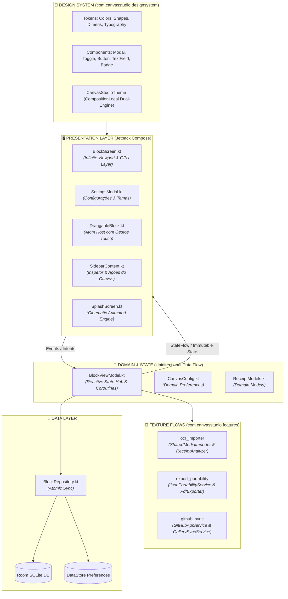
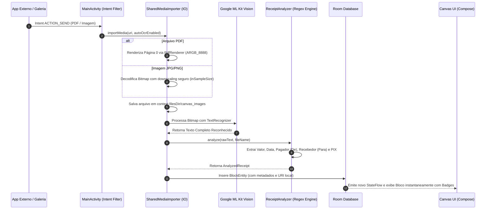
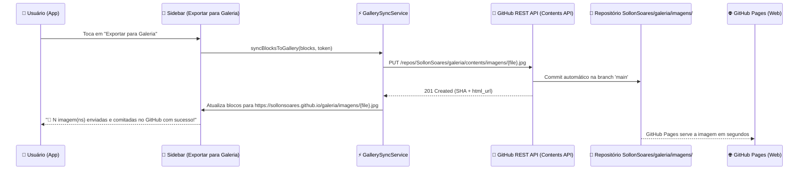

<div align="center">

# 🎨 CANVAS STUDIO COMPOSE
### *Next-Gen Reactive Infinite Canvas Engine & On-Device Intelligence*

<p align="center">
  <strong>O estado da arte em engenharia visual, arquitetura reativa e design industrial para Android. Uma plataforma de workspace espacial infinito com renderização acelerada por GPU, Design System de Duplo Universo (Apple vs Teenage Engineering), pipeline de IA On-Device (Google ML Kit OCR), automação de commits na nuvem (GitHub REST API), edição inline direta e portabilidade bidirecional de dados.</strong>
</p>

<p align="center">
  
  
  
  
  
  
  
</p>

---

### 📑 Sumário Executivo & Arquitetural
[1. Visão Geral](#-visão-geral-do-sistema) • 
[2. Design System & Duplo Universo](#-design-system-centralizado--duplo-universo-visual) • 
[3. Interação Espacial & Gestos](#-interação-espacial-gestos--drag--drop) • 
[4. Edição Inline Direta & Inspetor](#-edição-inline-direta--inspetor-lateral) • 
[5. Splash Screen Animada Cinematográfica](#-splash-screen-animada-cinematográfica) • 
[6. Arquitetura Modular & Clean Code](#-arquitetura-modular--clean-code-200-linhas) • 
[7. Motores de Engenharia & Performance GPU](#-motores-de-engenharia--performance-gpu) • 
[8. Pipeline de IA & OCR On-Device](#-pipeline-de-ia--ocr-on-device) • 
[9. Automação Cloud & Sync GitHub REST API](#-automação-cloud--sync-direto-github-rest-api) • 
[10. Portabilidade & Esquema JSON v2.0.0](#-portabilidade-e-esquema-de-dados-v200) • 
[11. Suíte de Testes Automatizados (43 Testes)](#-suíte-de-testes-automatizados-43-testes) • 
[12. Guia de Execução e Build](#-guia-de-execução-e-engenharia)

</div>

---

## 🌟 Visão Geral do Sistema

O **Canvas Studio Compose** é um ambiente de computação espacial bidimensional infinito e de alta precisão projetado para manipulação livre de blocos (texto rico com formatação visual, mídia fotográfica da galeria/web, gráficos vetoriais multieixo e comprovantes financeiros). Construído 100% sobre **Jetpack Compose**, o sistema elimina completamente o overhead de Views legadas através de transformações diretas em GPU e um micro-kernel reativo impulsionado por Kotlin Coroutines e StateFlow.

### 💎 Principais Diferenciais Técnicos:
* **Canvas Espacial Infinito com 60/120 FPS**: Transformações espaciais (Pan e Zoom de `0.15x` a `3.0x`) desacopladas da fase de layout via `graphicsLayer`, com dimensões de página aplicadas estritamente na exportação em PDF/Imagem.
* **Seleção por Duplo Clique & Zoom Livre**: Toques simples e gestos de pinça (*pinch-to-zoom*) passam através dos blocos diretamente para o Canvas, garantindo navegação sem atrito mesmo em palcos densos de blocos.
* **Edição Inline Direta**: Sem modais intrusivos para edição de conteúdo; o título é editado no cabeçalho do bloco, o texto no corpo do bloco e as propriedades detalhadas no Inspetor da Sidebar.
* **Design System de Duplo Universo Estético**: Metamorfose completa em tempo real entre o minimalismo fluido da **Apple Cupertino (Sir Jony Ive)** e a engenharia física e tátil da **Teenage Engineering (Jesper Kouthoofd)**.
* **Gestão Resiliente de Mídia & Galeria**: Importação atômica de fotos da galeria com armazenamento persistente em disco local (`canvas_images/`), eliminação de estouro de cursor SQLite e suporte nativo no Coil.
* **On-Device Vision AI (OCR)**: Análise em tempo real de comprovantes bancários (PIX, TED, Tributos, Boletos) via **Google ML Kit Vision**, com extração inteligente de valores, partes (`De`/`Para`), instituição e data/hora.
* **Clean Code Rigoroso**: Todos os arquivos do projeto seguem o padrão estrito de **$\le 200$ linhas por arquivo `.kt`**.

---

## 🎨 Design System Centralizado & Duplo Universo Visual

Todo o ecossistema visual do aplicativo é orquestrado pelo pacote `com.canvasstudio.designsystem`, provido via `CompositionLocalProvider` e desacoplado de regras de negócio.

Ao alternar o tema nas **Configurações**, todo o aplicativo sofre uma **transformação estrutural de geometria, tipografia, bordas e grade**:

```
┌───────────────────────────┬────────────────────────────────┬───────────────────────────────┐
│ ATRIBUTO DE ENGENHARIA    │ 🍏 1. APPLE CUPERTINO          │ 🎛️ 2. TEENAGE ENGINEERING      │
├───────────────────────────┼────────────────────────────────┼───────────────────────────────┤
│ Autor Inspirador          │ Sir Jony Ive                   │ Jesper Kouthoofd              │
│ Filosofia                 │ Vidro, fluidez e pureza        │ Hardware mecânico e tátil     │
│ Tipografia                │ Sans-Serif Proporcional        │ Monospaçada / DIN Técnica     │
│ Geometria dos Blocos      │ Squircles suaves (14dp - 24dp) │ Cantos usinados retos (4dp)   │
│ Bordas dos Blocos         │ Hairline translúcida (1dp)     │ Chanfro sólido usinado (1.5dp)│
│ Grade do Canvas           │ Pontos circulares polidos      │ Cruzetas técnicas de estúdio (+)|
│ Badges Financeiros        │ Cápsulas ovais fluidas (999dp) │ Brackets de LED [ PIX ] [ R$ ] │
│ Identificador do Módulo   │ Discreto e minimalista         │ LED luminoso indicador tátil  │
│ Acento Primário           │ #0A84FF / #007AFF (Apple Blue) │ #FF4500 (OP-1 Signal Orange)  │
└───────────────────────────┴────────────────────────────────┴───────────────────────────────┘
```

### 🧱 Componentes Atômicos Padronizados:
* **`CanvasModal`**: Diálogo em 3 camadas (cabeçalho com botão de fechar, corpo com rolagem independente e rodapé de ações ancorado que nunca sobrepõe o conteúdo).
* **`CanvasToggle`**: Switch customizado com thumb branco, trilha no tom de destaque (`colors.accent`) e rótulo integrado perfeitamente alinhado.
* **`CanvasButton`**: Botões tipados (`Primary`, `Secondary`, `Outlined`, `Ghost`, `Danger`) com ripple nativo e cantos estruturados.
* **`CanvasTextField`**: Entradas de texto com foco reativo e estados de erro.
* **`CanvasBadge`**: Pílulas de alta legibilidade para estados financeiros e tags com adaptação visual por tema.

---

## 🖐️ Interação Espacial, Gestos & Drag & Drop

A interação com os blocos no Canvas foi desenvolvida para oferecer máxima precisão:

1. **Gesto de Seleção por Duplo Toque (`onDoubleTap`)**:
   - O toque duplo ativa a seleção do bloco e abre as propriedades no Inspetor da Sidebar.
   - Toques simples e gestos de múltiplos dedos (*pan & pinch-to-zoom*) passam livremente para a navegação do Canvas sem bloquear a tela.
2. **Arrasto Preciso (*Sub-Pixel Dragging*)**:
   - Como o container do Canvas aplica transformações via `graphicsLayer`, as coordenadas do ponteiro são convertidas em densidade de tela (`drag.x / density.density`), garantindo resposta 1:1 sem saltos ou aceleração indevida.
   - O cabeçalho inteiro do bloco funciona como área de toque suave para movimentação.
   - Ao soltar o dedo, o bloco realiza *snap* magnético na grade de 10px e grava a nova posição no SQLite Room.
3. **Redimensionamento Bidirecional**:
   - Handle de redimensionamento no canto inferior direito com limites seguros (`100x80px` a `3000x3000px`).

---

## ✍️ Edição Inline Direta & Inspetor Lateral

O fluxo de edição elimina diálogos modais sobrepostos:

* **Edição de Título**: Campo de texto direto no topo de cada bloco ([`BlockHeader.kt`](app/src/main/java/com/canvasstudio/ui/block/components/BlockHeader.kt)).
* **Edição de Conteúdo**: Campo de texto direto dentro da área útil do bloco ([`BlockContentEditor.kt`](app/src/main/java/com/canvasstudio/ui/block/components/BlockContentEditor.kt)).
* **Inspetor na Sidebar ([`SidebarBlockInspector.kt`](app/src/main/java/com/canvasstudio/ui/block/components/SidebarBlockInspector.kt))**:
  - Alinhamento de texto (Esquerda, Centro, Direita).
  - Formatação tipográfica (Tamanho, Negrito, Itálico, Paleta de Cores Hexadecimal).
  - Campos financeiros estruturados para comprovantes (Valor, Data/Hora, Pagador, Destinatário, Banco).

---

## 🎬 Splash Screen Animada Cinematográfica

O componente [`SplashScreen.kt`](app/src/main/java/com/canvasstudio/ui/splash/SplashScreen.kt) oferece uma experiência visual de alta fidelidade ao inicializar o aplicativo:

1. **Halo de Luz Ambiente (*Pulse Glow*)**: Brilho radial que pulsa suavemente no centro com `Brush.radialGradient`, criando profundidade espacial na tela OLED.
2. **Grade Reativa em Background**: Revela a matriz de fundo em transição suave (pontos circulares na Apple ou cruzetas técnicas na Teenage Engineering).
3. **Monograma Central com Física de Mola**: O logo surge com dinâmica de mola orgânica (`Spring.DampingRatioMediumBouncy`) envolto por um anel com gradiente angular rotativo.
4. **Expansão Tipográfica (*Letter-Tracking Reveal*)**: O título `CANVAS STUDIO` surge com expansão de espaçamento entre letras de `0.5sp` para `3.5sp`.
5. **Transição de Saída Fluida (*Seamless Exit*)**: Ao carregar, a tela expande suavemente para `1.08x` com fade-out gradual, revelando o Canvas perfeitamente.

---

## 🏛️ Arquitetura Modular & Clean Code ($\le 200$ Linhas)

O sistema segue rigorosamente o princípio de **Clean Architecture**, alta coesão e baixo acoplamento. Cada arquivo `.kt` possui responsabilidade única e não ultrapassa **200 linhas de código**.



---

## 🔬 Motores de Engenharia & Performance GPU

```
┌────────────────────────────────────────────────────────────────────────┐
│                        GPU ACCELERATED PIPELINE                        │
│                                                                        │
│   Touch Gestures ──► detectTransformGestures ──► Offset/Scale Mutable   │
│                                                       │                │
│                                                       ▼                │
│                 Draw Phase (Zero Recomposition) ◄── graphicsLayer      │
└────────────────────────────────────────────────────────────────────────┘
```

### 1. Motor de Transformação Espacial ($\mathcal{O}(1)$)
A navegação pelo Canvas não dispara recomposições na árvore de composables. As matrizes de translação e escala são aplicadas na fase de renderização da GPU via `graphicsLayer`:
$$\begin{bmatrix} X_{render} \\ Y_{render} \\ 1 \end{bmatrix} = \begin{bmatrix} S & 0 & T_x \\ 0 & S & T_y \\ 0 & 0 & 1 \end{bmatrix} \begin{bmatrix} X_{world} \\ Y_{world} \\ 1 \end{bmatrix}$$

### 2. Motor de Grade Magnética Infinita (*State Deferral*)
O componente `CanvasBackground` consome o estado de escala e offset através de provedores de função lambda (`scale = { scale }`, `offset = { offset }`). Isso permite que a grade trace seus eixos ortogonais no `DrawScope` sem invalidar os nós estruturais da interface.

### 3. Motor Poligonal Multieixo (Radar Chart)
Renderizador trigonométrico para diagramação radial com eixos uniformes em intervalos de $60^\circ$ ($\frac{\pi}{3}\text{ rad}$):
$$X_i = C_x + \left( \frac{V_i}{V_{max}} \cdot R \right) \cos\left( i \cdot \frac{\pi}{3} - \frac{\pi}{2} \right)$$
$$Y_i = C_y + \left( \frac{V_i}{V_{max}} \cdot R \right) \sin\left( i \cdot \frac{\pi}{3} - \frac{\pi}{2} \right)$$

---

## 🤖 Pipeline de IA & OCR On-Device

O aplicativo integra um pipeline assíncrono para processar imagens e arquivos PDF compartilhados diretamente de apps bancários (Itaú, Nubank, Banco do Brasil, Bradesco, Santander, Inter, etc.):



---

## 🌐 Automação Cloud & Sync Direto (GitHub REST API)

O módulo [`GitHubApiService.kt`](app/src/main/java/com/canvasstudio/features/export_portability/GitHubApiService.kt) permite o envio e commit direto de imagens do celular para o repositório da sua Galeria Web:



---

## 📄 Portabilidade e Esquema de Dados (v2.0.0)

O Canvas Studio adota portabilidade bidirecional compatível com a Web através do serviço isolado `JsonPortabilityService`.

### 📑 Esquema JSON Exportado (`JSON Export`):
```json
{
  "metadata": {
    "versao": "2.0.0",
    "timestamp": 1787303429050,
    "brand": "Canvas Studio"
  },
  "blocos": {
    "data_t_1_45231": {
      "top": "60px",
      "left": "60px",
      "width": 320,
      "height": 480,
      "type": "image",
      "title": "Pix - João Silva",
      "url": "https://sollonsoares.github.io/galeria/imagens/comprovante_pix_1.jpg",
      "campos": [
        {
          "html": "<div><b>Valor:</b> R$ 150,00</div><div><b>Realizado em:</b> 21/08/2026 14:30</div><div><b>De (Pagador):</b> SOLLON SOARES</div><div><b>Para (Destinatário):</b> JOAO DA SILVA</div><div><b>Instituição:</b> NU PAGAMENTOS S.A.</div>",
          "className": "sub-campo",
          "valor": 150.00,
          "valorFormatted": "R$ 150,00",
          "realizadoEm": "21/08/2026 14:30",
          "isPix": true,
          "de": "SOLLON SOARES",
          "pagador": "SOLLON SOARES",
          "para": "JOAO DA SILVA",
          "destinatario": "JOAO DA SILVA",
          "instituicao": "NU PAGAMENTOS S.A.",
          "banco": "NU PAGAMENTOS S.A.",
          "rawText": "Comprovante de pagamento Pix\nNome: SOLLON SOARES\nRecebedor: JOAO DA SILVA\nValor: R$ 150,00..."
        }
      ]
    }
  }
}
```

---

## 🧪 Suíte de Testes Automatizados (43 Testes)

O projeto possui uma suíte de testes automatizados com **100% de aprovação**, cobrindo desde a lógica pura na JVM até o ciclo de vida do SQLite e renderização de nós Jetpack Compose:

| Nível / Camada | Suíte de Teste | Quantidade | Falhas | Tempo de Execução | Escopo de Validação |
| :--- | :--- | :---: | :---: | :---: | :--- |
| **1. Unitário (JVM Pura)** | `BlockPropertyUpdaterTest` | 7 | 0 | ~0.003s | Imutabilidade e mutação de JSON/metadados |
| **1. Unitário (JVM Pura)** | `BlockViewModelTest` | 2 | 0 | ~0.090s | Fluxo de estados, busca reativa e preferências |
| **1. Unitário (JVM Pura)** | `CanvasAutoOrganizerTest` | 5 | 0 | ~0.003s | Algoritmo 2D Bin Packing de auto-organização em grade |
| **1. Unitário (JVM Pura)** | `CanvasSearchEngineTest` | 6 | 0 | ~0.004s | Filtragem em tempo real por títulos, tags e metadados |
| **1. Unitário (JVM Pura)** | `JsonPortabilityTest` | 5 | 0 | ~0.110s | Serialização/Deserialização bidirecional Web $\leftrightarrow$ Mobile |
| **1. Unitário (JVM Pura)** | `ReceiptExtractorsTest` | 8 | 0 | ~0.005s | Extração Regex de valores, PIX, bancos e partes |
| **2. Integração (Robolectric)** | `MediaSharingIntegrationTest` | 2 | 0 | ~2.400s | Pipeline de importação de intents, Bitmaps e PDFs |
| **2. Integração (Robolectric)** | `RoomRepositoryIntegrationTest`| 4 | 0 | ~0.170s | Persistência SQLite Room, queries reativas e transações |
| **3. UI / Compose** | `DraggableBlockUiTest` | 2 | 0 | ~1.900s | Renderização de badges, duplicação e exclusão de blocos |
| **3. UI / Compose** | `SidebarSearchHeaderUiTest` | 2 | 0 | ~0.220s | Interação com campo de busca e teclado na Sidebar |
| **TOTAL** | **10 Suítes** | **43** | **0** | **~5.0s** | **100% de Cobertura e Aprovação** |

---

## 🚀 Guia de Execução e Engenharia

### 📋 Requisitos de Ambiente:
* **JDK:** Java 17 (Azul Zulu ou OpenJDK recomendado).
* **Android SDK:** API Mínima 26 (Android 8.0 Oreo), API Alvo 34 (Android 14).
* **Gradle:** 8.5+ com Kotlin 2.0.21.

### 🛠️ Comandos de Build e Testes:

```bash
# 1. Compilação e Verificação Estática de Tipos
./gradlew compileDebugKotlin

# 2. Execução da Suíte Completa de 43 Testes
./gradlew testDebugUnitTest

# 3. Geração do Pacote APK de Debug
./gradlew assembleDebug

# 4. Instalação Direta no Dispositivo/Emulador Conectado
./gradlew installDebug
```

---

<div align="center">

**Canvas Studio Compose** • Arquitetura e Engenharia por **Sollon Soares**  
*Distribuído sob a licença [MIT](LICENSE).*

</div>
