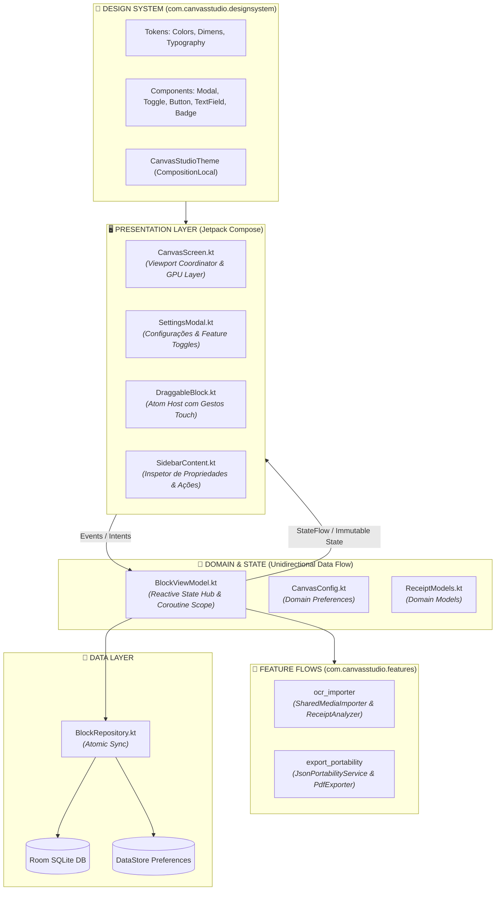
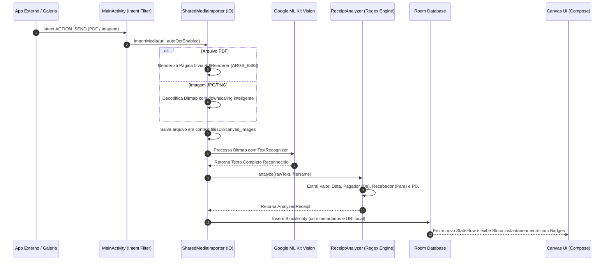

<div align="center">

# 🎨 CANVAS STUDIO COMPOSE
### *Next-Gen Reactive Infinite Canvas Engine & On-Device Intelligence*

<p align="center">
  <strong>O estado da arte em engenharia visual e arquitetura reativa para Android. Uma plataforma de workspace infinito com renderização acelerada por GPU, Design System estrito, pipeline de inteligência On-Device (Google ML Kit OCR) e portabilidade bidirecional de dados.</strong>
</p>

<p align="center">
  
  
  
  
  
</p>

---

### 📑 Sumário Executivo & Arquitetural
[1. Visão Geral](#-visão-geral-do-sistema) • 
[2. Design System Centralizado](#-design-system-centralizado) • 
[3. Arquitetura Modular por Flows](#-arquitetura-modular-por-flows) • 
[4. Motores de Engenharia & Performance](#-motores-de-engenharia--performance) • 
[5. Pipeline de IA & OCR de Comprovantes](#-pipeline-de-ia--ocr-on-device) • 
[6. Portabilidade & Esquema JSON](#-portabilidade-e-esquema-de-dados) • 
[7. Execução e Build](#-guia-de-execução-e-engenharia)

</div>

---

## 🌟 Visão Geral do Sistema

O **Canvas Studio Compose** é um ambiente de alta precisão projetado para manipulação espacial livre de blocos (texto rico, mídia de alta resolução, gráficos multieixo e comprovantes financeiros). Construído 100% sobre **Jetpack Compose**, o sistema elimina completamente o overhead de Views legadas através de transformações diretas em GPU e um micro-kernel reativo impulsionado por Kotlin Coroutines e StateFlow.

### 💎 Principais Diferenciais Técnicos:
* **Renderização 60/120 FPS sem Recomposição Excessiva**: Transformações espaciais (Pan e Zoom de `0.15x` a `3.0x`) desacopladas da fase de layout via `graphicsLayer`.
* **Design System Atômico Estrito**: Interface com tokens unificados para Modo Claro e Escuro, tipografia proporcional e componentes reutilizáveis padronizados (`CanvasModal`, `CanvasToggle`, `CanvasButton`, `CanvasTextField`, `CanvasCard`).
* **On-Device Vision AI (OCR)**: Análise em tempo real de comprovantes bancários (PIX, TED, Tributos, Boletos) via **Google ML Kit Vision**, com extração inteligente de valores, partes (`De`/`Para`), instituição e timestamp.
* **Persistência I/O Otimizada**: Prevenção do limite de 2MB do `CursorWindow` do SQLite através do salvamento atômico em disco de arquivos locais (`file:///`) com metadados estruturados em Room.

---

## 🎨 Design System Centralizado

Todo o ecossistema visual do aplicativo é orquestrado pelo pacote `com.canvasstudio.designsystem`, provido via `CompositionLocalProvider` e desacoplado de regras de negócio.

### 🎭 Tokens de Cores Semânticas (`CanvasColors`)

| Token Semântico | Dark Theme (`DarkCanvasColors`) | Light Theme (`LightCanvasColors`) | Finalidade de Uso |
| :--- | :--- | :--- | :--- |
| **`accent`** | `#0A84FF` *(Apple Blue)* | `#007AFF` *(Apple Blue)* | Ações primárias, foco e seleção ativa. |
| **`accentVariant`** | `#5AC8FA` | `#0056B3` | Destaques secundários e gradientes. |
| **`bgMain`** | `#000000` *(Pure Black)* | `#F2F2F7` *(System Light)* | Palco de trabalho e viewport infinito. |
| **`bgMenu` / `bgCard`** | `#1C1C1E` / `#2C2C2E` | `#FFFFFF` | Superfícies elevadas, drawers e modais. |
| **`bgInput`** | `#26767680` | `#0F000000` | Campos de entrada e backgrounds de controle. |
| **`badgePix`** | `#32BCAD` *(Teal/Ciano)* | `#00A896` | Identificação visual de transações PIX. |
| **`success`** | `#34C759` *(System Green)* | `#28A745` | Valores monetários e validações positivas. |
| **`danger`** | `#FF453A` *(System Red)* | `#FF3B30` | Bloqueio, exclusão e alertas críticos. |

### 🧱 Componentes Atômicos Padronizados:
* **`CanvasModal`**: Diálogo em 3 camadas (cabeçalho fixo com botão de fechar, corpo com rolagem independente e rodapé de ações ancorado que nunca sobrepõe o conteúdo).
* **`CanvasToggle`**: Switch customizado com thumb branco, trilha no azul de destaque (`colors.accent`) e escala uniforme de `0.85f`.
* **`CanvasButton`**: Botões tipados (`Primary`, `Secondary`, `Outlined`, `Ghost`, `Danger`) com ripple nativo e cantos arredondados.
* **`CanvasTextField`**: Entradas de texto com foco reativo e estados de erro.
* **`CanvasBadge`**: Pílulas de alta legibilidade para estados financeiros e tags.

---

## 🏛️ Arquitetura Modular por Flows

O sistema adota os princípios de **Clean Architecture** e **Modular Feature-Driven Development**:



---

## 🔬 Motores de Engenharia & Performance

```
┌────────────────────────────────────────────────────────────────────────┐
│                        GPU ACCELERATED PIPELINE                        │
│                                                                        │
│   Touch Gestures ──► detectTransformGestures ──► Offset/Scale Mutable   │
│                                                       │                │
│                                                       ▼                │
│                 Draw Phase (Zero Recomposition) ◄── graphicsLayer      │
└────────────────────────────────────────────────────────────────────────┘
```

### 1. Motor de Transformação Espacial ($\mathcal{O}(1)$)
A navegação pelo Canvas não dispara recomposições na árvore de composables. As matrizes de translação e escala são aplicadas na fase de renderização da GPU via `graphicsLayer`:
$$\begin{bmatrix} X_{render} \\ Y_{render} \\ 1 \end{bmatrix} = \begin{bmatrix} S & 0 & T_x \\ 0 & S & T_y \\ 0 & 0 & 1 \end{bmatrix} \begin{bmatrix} X_{world} \\ Y_{world} \\ 1 \end{bmatrix}$$

### 2. Motor de Grade Magnética Infinita (*State Deferral*)
O componente `CanvasBackground` consome o estado de escala e offset através de provedores de função lambda (`scale = { scale }`, `offset = { offset }`). Isso permite que a grade trace seus eixos ortogonais no `DrawScope` sem invalidar os nós estruturais da interface.

### 3. Motor Poligonal Multieixo (Radar Chart)
Renderizador trigonométrico para diagramação radial com eixos uniformes em intervalos de $60^\circ$ ($\frac{\pi}{3}\text{ rad}$):
$$X_i = C_x + \left( \frac{V_i}{V_{max}} \cdot R \right) \cos\left( i \cdot \frac{\pi}{3} - \frac{\pi}{2} \right)$$
$$Y_i = C_y + \left( \frac{V_i}{V_{max}} \cdot R \right) \sin\left( i \cdot \frac{\pi}{3} - \frac{\pi}{2} \right)$$

---

## 🤖 Pipeline de IA & OCR On-Device

O aplicativo integra um pipeline assíncrono para processar imagens e arquivos PDF compartilhados diretamente de apps bancários (Itaú, Nubank, Banco do Brasil, Bradesco, Santander, Inter, etc.):



### 🎯 Capacidades do Extrator:
* **Identificação de Transação PIX**: Detecta chaves, termos bancários e aplica badge ciano `[PIX]`.
* **Segregação Rigorosa de Partes**: Separação precisa entre Pagador/Origem (`De`) e Destinatário/Favorecido (`Para`), eliminando falsos positivos com preposições.
* **Formatador Monetário**: Conversão de strings de OCR para floats numéricos auditáveis (`R$ 1.250,50` $\rightarrow$ `1250.50f`).
* **Timestamp**: Captura e formatação de data/hora da realização do pagamento.

---

## 📄 Portabilidade e Esquema de Dados

O Canvas Studio adota portabilidade bidirecional compatível com a Web e outros sistemas analíticos através do serviço isolado `JsonPortabilityService`.

### 📑 Esquema JSON Exportado (`JSON Export`):
Todos os valores financeiros, metadados e o **texto bruto completo do OCR (`rawText`)** são preservados diretamente dentro do array `campos` de cada bloco:

```json
{
  "metadata": {
    "versao": "2.0.0",
    "timestamp": 1787295483878,
    "brand": "Canvas Studio"
  },
  "blocos": {
    "data_t_1_45231": {
      "top": "60px",
      "left": "60px",
      "width": 320,
      "height": 480,
      "type": "image",
      "title": "Pix - João Silva",
      "url": "file:///data/user/0/com.canvasstudio/files/canvas_images/comprovante_123.jpg",
      "campos": [
        {
          "html": "<div><b>Valor:</b> R$ 150,00</div><div><b>Realizado em:</b> 21/08/2026 14:30</div><div><b>De (Pagador):</b> SOLLON SOARES</div><div><b>Para (Destinatário):</b> JOAO DA SILVA</div><div><b>Instituição:</b> NU PAGAMENTOS S.A.</div>",
          "className": "sub-campo",
          "valor": 150.00,
          "valorFormatted": "R$ 150,00",
          "realizadoEm": "21/08/2026 14:30",
          "isPix": true,
          "de": "SOLLON SOARES",
          "pagador": "SOLLON SOARES",
          "para": "JOAO DA SILVA",
          "destinatario": "JOAO DA SILVA",
          "instituicao": "NU PAGAMENTOS S.A.",
          "banco": "NU PAGAMENTOS S.A.",
          "rawText": "Comprovante de pagamento Pix\nNome: SOLLON SOARES\nRecebedor: JOAO DA SILVA\nValor: R$ 150,00..."
        }
      ]
    }
  }
}
```

---

## 🚀 Guia de Execução e Engenharia

### 📋 Requisitos de Ambiente:
* **JDK:** Java 17 (Azul Zulu ou OpenJDK recomendado).
* **Android SDK:** API Mínima 26 (Android 8.0 Oreo), API Alvo 34 (Android 14).
* **Gradle:** 8.5+ com Kotlin 2.0.21.

### 🛠️ Comandos de Build e Execução:

```bash
# 1. Compilação e Verificação Estática de Tipos
./gradlew compileDebugKotlin

# 2. Execução dos Testes Unitários de Arquitetura
./gradlew testDebugUnitTest

# 3. Geração do Pacote APK de Debug
./gradlew assembleDebug

# 4. Instalação Direta no Dispositivo/Emulador Conectado
./gradlew installDebug
```

---

<div align="center">

**Canvas Studio Compose** • Arquitetura e Engenharia por **Sollon Soares**  
*Distribuído sob a licença [MIT](LICENSE).*

</div>
