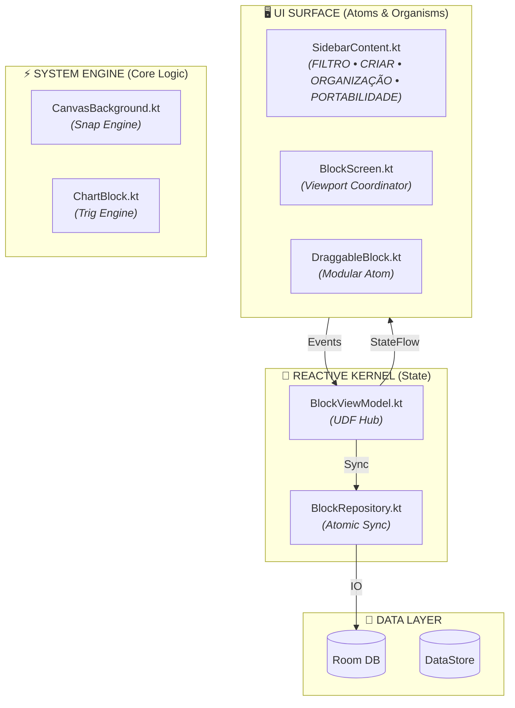

<div align="center">

# 🥷 CANVAS STUDIO COMPOSE — NARUTO RPG
### *High-Fidelity Visual Workspace & Modular Shinobi Engine*

<p align="center">
  <strong>A transposição mobile definitiva do Canvas Studio. Interface <em>macOS-inspired</em> com <em>Glassmorphism</em> nativo, orquestrada por uma arquitetura de <em>Reactive Micro-Kernel</em> e <em>UDF</em>.</strong><br>
  Ambiente de engenharia visual com <em>Snap-to-Grid</em> rigoroso, radar trigonométrico de atributos e persistência atômica.
</p>

<p align="center">
  <a href="#"></a>
  
  
  
</p>

---

### 📑 Architecture & Design Index
[1. Design System Tokens](#-design-system--tokens-visuais) • 
[2. Modular Architecture](#-arquitetura-modular-do-sistema) • 
[3. Core Engines](#-motores-e-fundamentos-matemáticos) • 
[4. Module Matrix](#-matriz-de-módulos-sistêmicos) • 
[5. Implementation](#-como-executar-localmente)

</div>

---

## 🎨 Design System & Tokens Visuais

O sistema adota o **macOS Glassmorphism Standard**, garantindo profundidade visual e hierarquia clara através de transparências e blur.

<details>
<summary><b>▶️ Especificações de Tokens e Superfícies</b></summary>

<br>

### 💎 Glassmorphism Standard
Toda superfície elevada no sistema deve seguir o contrato de renderização:
- **Alpha:** `0.82f` (Opacidade de fundo).
- **Background Blur:** `20.dp` (Renderização via `graphicsLayer`).
- **Border:** `1.dp` com Alpha `0.1f` (Cor: `White`).
- **Corner Radius:** `16.dp` (Padrão para cards e diálogos).

### 🎨 Color Palette (Tokens)
| Categoria | Token | Valor Hex | Uso Semântico |
| :--- | :--- | :--- | :--- |
| **Accent** | `Apple Blue` | `#0A84FF` | Ações primárias e indicadores de foco. |
| **Danger** | `Apple Red` | `#FF453A` | Ações destrutivas e estados de erro. |
| **Surface** | `Glass Deep` | `#1A1D29` | Base para componentes com blur. |

```kotlin
// Referência de Implementação do Sistema
Modifier
    .clip(RoundedCornerShape(16.dp))
    .background(Color(0x1A1D29).copy(alpha = 0.82f))
    .blur(20.dp)
    .border(1.dp, Color.White.copy(alpha = 0.1f))
```

</details>

---

<<<<<<< HEAD
## 🏛️ Arquitetura Modular do Sistema

O Canvas Studio Compose é dividido em camadas de responsabilidade única, evitando itens avulsos e garantindo escalabilidade via Unidirectional Data Flow (UDF).

<details>
<summary><b>▶️ Visualizar Hierarquia Modular e Fluxo de Dados</b></summary>

<br>

### Diagrama de Micro-Kernel Reativo


</details>

---

## 🔬 Motores e Fundamentos Matemáticos

O sistema opera sob leis matemáticas estritas para garantir paridade 1:1 com a lógica Web e as métricas do RPG.

<details>
<summary><b>▶️ Especificações dos Motores de Cálculo</b></summary>

<br>

### 1. Motor de Snap-to-Grid Magnético (20dp)
O sistema ignora posições intermediárias, forçando o alinhamento magnético atômico:
$$P_{snap} = \text{round}\left( \frac{P_{raw}}{20} \right) \cdot 20$$

### 2. Motor de Radar Trigonométrico (Naruto RPG)
O gráfico de atributos utiliza 6 eixos simétricos com intervalos constantes de $60^\circ$ ($\frac{\pi}{3}$ rad):
- **Ângulo do Eixo $i$:** $\theta_i = (i \cdot \frac{\pi}{3}) - \frac{\pi}{2}$
- **Projeção de Vértice:** 
  - $X = C_x + \left( \frac{V_i}{V_{max}} \cdot R \right) \cdot \cos(\theta_i)$
  - $Y = C_y + \left( \frac{V_i}{V_{max}} \cdot R \right) \cdot \sin(\theta_i)$

</details>

---

## 🗂️ Matriz de Módulos Sistêmicos

Hierarquia modular organizada pela funcionalidade no ecossistema do Design System.

<details>
<summary><b>▶️ Catálogo de Módulos e Responsabilidades</b></summary>

<br>

| Camada | Módulo | Responsabilidade Técnica |
| :--- | :--- | :--- |
| **Viewport** | `Coordenador` | Gestão de escala (0.15f a 3.0f) e translação do palco. |
| **Grid Engine** | `CanvasBackground` | Renderização e cálculo do grid magnético de 20dp. |
| **Dashboard** | `SidebarContent` | Navegação estruturada em: **FILTRO**, **CRIAR**, **ORGANIZAÇÃO**, **PORTABILIDADE**. |
| **Property Editor**| `EditBlockDialog` | Refatoração de propriedades e edição atômica de blocos. |
| **Rich Text** | `RichTextHandler` | Parser de tags Web (html/campos) para `AnnotatedString`. |
| **Chart System** | `ChartBlock` | Motor de radar poligonal simétrico ($\pi/3$ rad). |
| **Image Core** | `Coil integration` | Gerenciamento de cache Lru e renderização assíncrona. |

</details>

---

## 📊 Métricas e Performance

<details>
<summary><b>▶️ Análise de Complexidade e Eficiência</b></summary>

<br>

- **Snap-to-Grid:** $\mathcal{O}(1)$ - Cálculo matemático puro sem iteração.
- **Radar Rendering:** $\mathcal{O}(6)$ - Vértices fixos processados via GPU (DrawScope).
- **State Update:** $\mathcal{O}(N)$ - Sincronização atômica de $N$ blocos via Room Flowbus.

</details>

---

## 🚀 Como Executar Localmente

<details>
<summary><b>▶️ Requisitos de Ambiente de Engenharia</b></summary>

<br>

1. **Android Studio Jellyfish**+ (ou superior).
2. **Gradle 8.5**+ com suporte a Kotlin 2.0.
3. **Dispositivo/Emulador:** Mínimo Android API 26 (Oreo).
4. **Build:** `gradle assembleDebug` para compilação nativa.

</details>

---

<div align="center">

**Sollon Soares** — *Lead Shinobi Engineer*
Distributed under **MIT License**.

</div>
=======
## 🚀 3. Tecnologias Utilizadas
*   **Linguagem:** Kotlin
*   **UI Toolkit:** Jetpack Compose (Material Design 3)
*   **Asynchrony:** Kotlin Coroutines & Flows
*   **Local DB:** Room Database (SQLite)
*   **Preferences:** Jetpack DataStore
*   **Serialization:** Kotlinx Serialization
*   **Image Loading:** Coil Image Loader

---

## Protocolo ATE - Relatório de Abortagem de Automação e Resolução Direta

### 1. Sintaxe Gramatical

* **Falha de Caracteres Especiais no Terminal (`<─>`)**: O PowerShell falhou ao processar os caracteres de seta (`<─>`) dentro do bloco de texto puro em linha de comando, corrompendo a execução ou gerando um erro de interpretador de script no terminal do Windows.

### 2. Performance/Complexidade

* **Interrupção de Scripts**: Automações via linha de comando para escrita de textos longos ou diagramas textuais geram fricção desnecessária devido a restrições de codificação do console (`UTF-8`/`ANSI`).

---

### ## Solução Definitiva: Cópia Manual Direta

Para evitar qualquer falha de terminal ou quebra de arquivos, **não use o PowerShell**.

Abra o arquivo `README.md` na raiz do seu projeto usando o seu editor de texto (Android Studio, VS Code ou Bloco de Notas), apague tudo o que estiver lá dentro e **cole diretamente** o bloco de texto exato abaixo:

```markdown
# Canvas Studio Compose

Aplicativo Android estruturado sob a arquitetura moderna de desenvolvimento (MAD), demonstrando um fluxo unidirecional de dados (UDF) com persistência local e interface totalmente reativa.

## Pilha Tecnológica & Bibliotecas

- **Linguagem:** Kotlin (JVM Target 17)
- **Interface Gráfica:** Jetpack Compose (Material Design 2 & 3)
- **Persistência de Dados:** Room Database (SQLite)
- **Assincronismo:** Kotlin Coroutines & Asynchronous Flows (StateFlow)
- **Gerenciamento de Ciclo de Vida:** Jetpack Lifecycle (ViewModel & Lifecycle-aware components)
- **Injeção de Dependências:** Manual via padrão Container (AppContainer)

---

## Arquitetura do Sistema

O projeto adota o padrão arquitetural **MVVM (Model-View-ViewModel)** com separação estrita de conceitos em camadas:


```

[ Camada de UI ]          MainActivity (Jetpack Compose Screen)
▲
│ (Coleta uiState via StateFlow)
[ Camada de Apresentação ] ProjectViewModel (Retém estado / Dispara Coroutines)
▲
│
[ Camada de Negócios ]     ProjectRepository (Abstração de fontes de dados)
▲
│
[ Camada de Dados ]        ProjectDao <─> Room Database (SQLite)

```

1. **Camada de Dados:** Gerencia a entidade `ProjectEntity` e expõe fluxos de dados contínuos do SQLite através do Room.
2. **Camada de Apresentação:** O `ProjectViewModel` consome os fluxos do repositório, mapeia os dados para um estado de UI selado (`ProjectUiState`) e expõe um `StateFlow` otimizado para o ciclo de vida da aplicação.
3. **Camada de UI:** Composição declarativa que reage dinamicamente às mudanças de estado e delega eventos do usuário (inserção e deleção) de volta para o ViewModel.

---

## Como Executar o Projeto

### Pré-requisitos
- Android Studio
- JDK 17
- Dispositivo físico Android ou Emulador com API >= 26

### Execução via Linha de Comando (CLI)

1. Compilar o código fonte:
```bash
./gradlew compileDebugKotlin

```

2. Instalar o aplicativo no dispositivo conectado:

```bash
./gradlew installDebug

```

```

---

### Sincronização do Repositório

Após salvar o arquivo manualmente, execute os comandos do Git para atualizar o servidor remoto:

```cmd
git add README.md
git commit -m "docs: atualiza README.md manualmente"
git push

```
>>>>>>> cca11785fd61fc6a88c0f6560f7fc33c7be277ac
